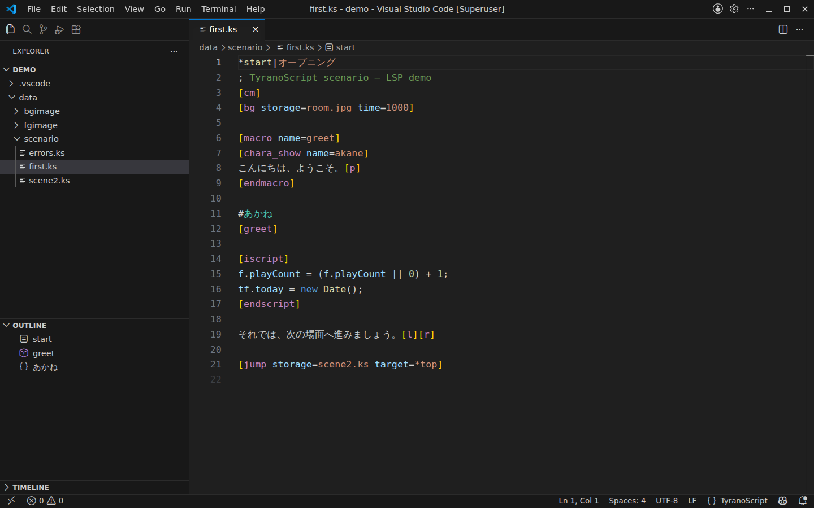
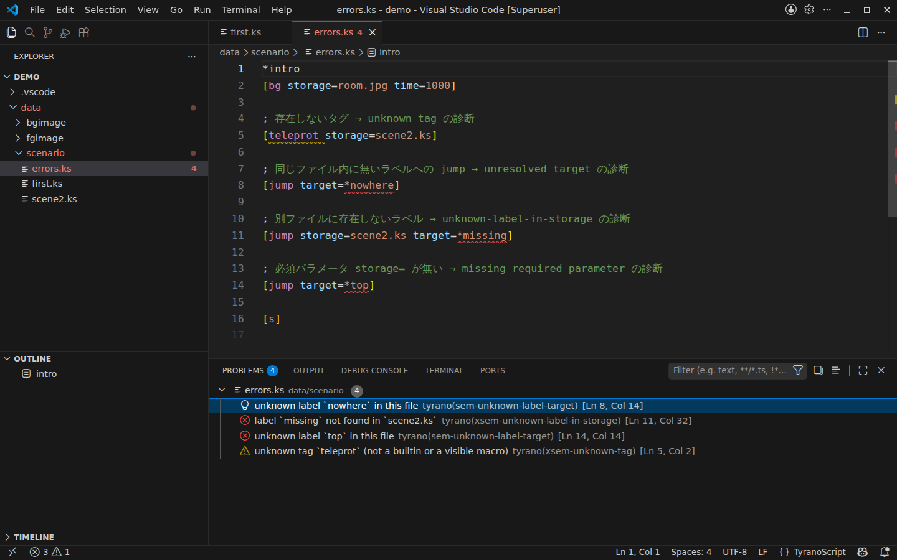
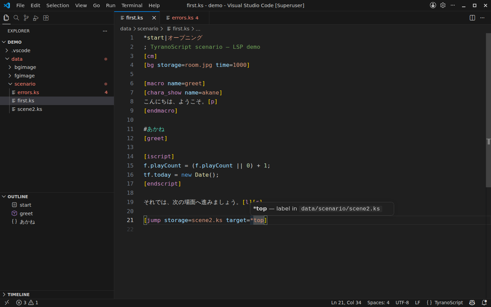
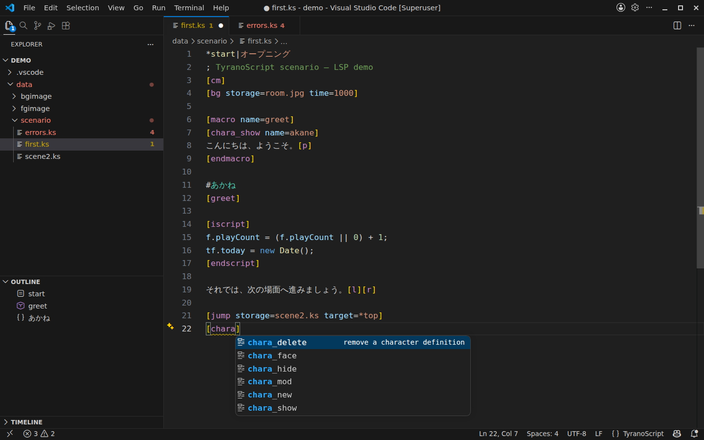
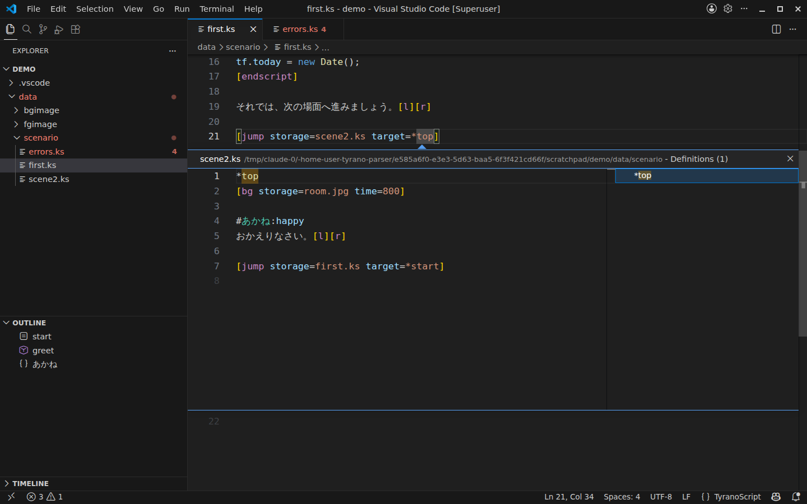
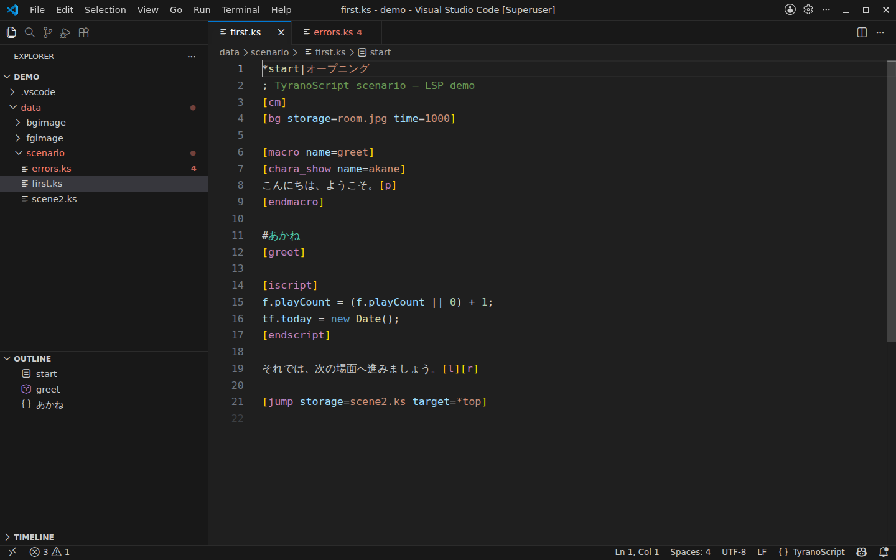

# TyranoScript for VS Code

<p>
  <a href="https://marketplace.visualstudio.com/items?itemName=darallium.tyranoscript-language-server"></a>
  <a href="https://marketplace.visualstudio.com/items?itemName=darallium.tyranoscript-language-server"></a>
  
</p>

**🌐 语言 / Language:** [日本語](README.md) ・ [English](README.en.md) ・ **中文**

为视觉小说引擎 **[TyranoScript](https://tyrano.jp/)**（`.ks` 剧本文件）提供的 VS Code 语言支持扩展。
除语法高亮外，基于 Rust 的语言服务器 **`tyrano-lsp`** 还为 `.ks` 文件带来诊断、补全、跳转到定义、查找引用等完整的 “IDE” 功能。



---

## ✨ 功能一览

| 功能 | 说明 | 服务器 |
|------|------|:---:|
| [语法高亮](#-语法高亮) | 为标签、标签定义、注释以及内嵌 JS/HTML 着色 | 不需要 |
| [实时诊断](#-实时诊断) | 标记未知标签、无法解析的跳转、缺失素材等 | 需要 |
| [悬停信息](#-悬停信息) | 弹出标签、参数、标签定义的说明 | 需要 |
| [输入补全](#-输入补全) | 提示标签名、参数名与参数值 | 需要 |
| [跳转到定义 / 查找引用](#-跳转到定义--查找引用) | 跨文件追踪标签与宏 | 需要 |
| [大纲 / 导航栏](#-大纲--导航栏) | 标签、宏、角色的可导航列表 | 需要 |

> 标注 “需要” 的功能依赖 `tyrano-lsp` 语言服务器，安装方法见[安装与配置](#-安装与配置)。**语法高亮仅凭扩展本身即可立即生效**。

---

### 🎨 语法高亮

打开 `.ks` 文件后，专为 TyranoScript 编写的 TextMate 语法会为各元素着色。
它**无需等待语言服务器启动、仅凭扩展本身即可生效**，因此打开剧本的瞬间就更易阅读。


主要着色元素：

- **标签定义** —— `*start|オープニング`（`|` 之后的标题也会区分）
- **标签** —— `[bg storage=room.jpg time=1000]`（标签名、参数名、参数值分别着色）
- **行注释** —— `; 这是注释`
- **角色名行** —— `#akane` / `#akane:happy`
- **内嵌脚本** —— `[iscript]` … `[endscript]` 内按 **JavaScript** 高亮，`[html]` … `[endhtml]` 内按 **HTML** 高亮

---

### 🚦 实时诊断

每次编辑与保存都会重新解析整个剧本，并用**波浪线**标记问题所在。
诊断会横跨**整个工程（多个文件）**，因此其他文件中的标签、`data/` 下的素材也会一并校验。



可检测的问题示例：

| 诊断代码 | 含义 |
|---------|------|
| `xsem-unknown-tag` | 既非内置也非可见宏的**未知标签**（如拼写错误的 `[teleprot]`） |
| `sem-unknown-label-target` | 跳转到同一文件中**不存在的标签**（`target=*nowhere`） |
| `xsem-unknown-label-in-storage` | `[jump]` 到**另一文件中不存在的标签**（`storage=scene2.ks target=*missing`） |
| `xsem-missing-asset` | `storage=` 引用的**图像/音频素材找不到** |
| `xsem-unknown-param` / `xsem-missing-param` | 标签上的**未知参数**，或**缺少必填参数** |

所有问题都会列在“问题（Problems）”面板（`Ctrl+Shift+M`）中，点击即可跳转到对应位置。

---

### 💡 悬停信息

将鼠标悬停在标签、参数或标签定义上（或将光标置于其上并按 `Ctrl+K Ctrl+I`），即可看到说明弹窗。
尤其是悬停在 `[jump]` 的目标标签上时，会解析出**该标签定义在哪个文件中**。



上例中，悬停 `target=*top` 便可一眼看出 `*top` 是定义在 `data/scenario/scene2.ks` 中的标签。

---

### ⌨️ 输入补全

自动提示标签名、参数名与参数值。
在输入 `[` 之后，或在输入途中按下 `Ctrl+Space`，都会打开候选列表，并在一侧显示**每个候选项的说明**。



- **标签名补全** —— 输入 `[cha` 会提示 `chara_show` / `chara_new` / `chara_hide` …
- **参数名补全** —— 仅提示该标签接受的参数
- **工程内的宏也是候选** —— 用 `[macro name=greet]` 定义的宏会作为 `[greet]` 被补全

---

### 🔗 跳转到定义 / 查找引用

在任意标签或宏上，可使用**跳转到定义**（`F12`）、**就地速览（Peek）**（`Alt+F12`）与**查找所有引用**（`Shift+F12`）。
通过 `storage=` 指向另一文件的跳转也会被解析，因此可以**跨文件追踪剧本流程**。



上例中，从 `first.ks` 的 `[jump storage=scene2.ks target=*top]` 追踪 `*top`，将 `scene2.ks` 中对应的定义行就地展开。

---

### 🗂️ 大纲 / 导航栏

文件中的**标签、宏、角色**会被结构化，并列在侧边栏的“大纲”视图以及编辑器顶部的“导航栏（breadcrumbs）”中。
即便是很长的剧本，也能单击跳转到目标标签。



按 `Ctrl+Shift+O` 打开符号搜索，输入标签名即可快速跳转。

---

## 🚀 安装与配置

### 1. 安装扩展

在扩展视图（`Ctrl+Shift+X`）中搜索 **“TyranoScript”** 进行安装，或从 [Marketplace 页面](https://marketplace.visualstudio.com/items?itemName=darallium.tyranoscript-language-server)安装。

打开 `.ks` 文件即会自动激活，**此时语法高亮已可用**。

### 2. 准备 `tyrano-lsp` 语言服务器（诊断、补全等所需）

诊断、悬停、补全、跳转到定义等功能需要基于 Rust 的语言服务器 **`tyrano-lsp`**。扩展会按以下顺序自动查找：

1. 设置项 `tyranoscript.server.path` 指定的绝对路径
2. `PATH` 环境变量中的 `tyrano-lsp`
3. `<扩展目录>/server/tyrano-lsp`
4. `<工作区>/target/release/tyrano-lsp`
5. `<工作区>/target/debug/tyrano-lsp`

若从源码构建，请 clone [代码仓库](https://github.com/darallium/tyrano-parser)并运行：

```bash
cargo build --release -p tyrano-lsp
```

随后将生成的 `target/release/tyrano-lsp` 放入上述任一位置，或通过设置指定其路径：

```jsonc
// settings.json
{
  "tyranoscript.server.path": "/absolute/path/to/tyrano-lsp"
}
```

> 若找不到服务器，扩展会通过错误提示说明安装方法。设置路径后，可通过**命令面板（`Ctrl+Shift+P`）→“TyranoScript: Restart Language Server”**重启服务器。

---

## ⚙️ 设置与命令

### 设置项

| 设置键 | 默认值 | 说明 |
|-------|--------|------|
| `tyranoscript.server.path` | `""` | `tyrano-lsp` 可执行文件的绝对路径。为空时按上述顺序自动检测。 |
| `tyranoscript.trace.server` | `off` | VS Code 与服务器之间的通信日志级别（`off` / `messages` / `verbose`），便于提交问题报告。 |

### 命令

| 命令 | 说明 |
|------|------|
| `TyranoScript: Restart Language Server` | 重启语言服务器（例如替换服务器可执行文件后）。 |

---

## 🐛 问题反馈与功能建议

请在 [GitHub Issues](https://github.com/darallium/tyrano-parser/issues) 页面提交缺陷与功能建议。
若能附上将 `tyranoscript.trace.server` 设为 `verbose` 后得到的通信日志，将有助于排查。

---

## ❤️ 支持开发

本扩展及其语言服务器是个人开发的免费项目。
如果它帮到了你，欢迎通过下方链接给予支持。

<a data-ofuse-widget-button href="https://ofuse.me/o?uid=101132" data-ofuse-id="101132" data-ofuse-size="large" data-ofuse-color="pink" data-ofuse-style="rectangle">OFUSEで応援を送る</a><script async src="https://ofuse.me/assets/platform/widget.js" charset="utf-8"></script>

---

## 📄 许可证

以 [MIT License](LICENSE) 发布。
